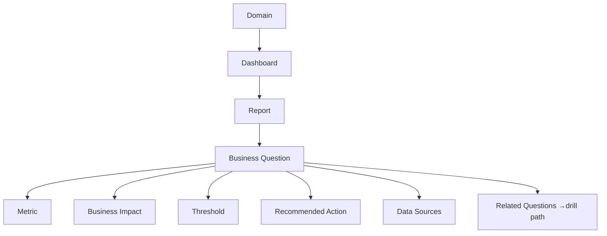

# Enterprise AI Analytics — Library Architecture & Schema (v2)

**Supersedes the flat question lists** (`kling-analytics-question-library.md`, `enterprise-ai-analytics-question-library.md`) with a structured, guided-analytics model: **Domain → Dashboard → Report → Business Question**, where every question carries impact, thresholds, actions, data dependencies, audience, tier, readiness and drill-links.

Companion machine-readable seed: [`analytics-library.seed.json`](analytics-library.seed.json) (JSON Schema + fully-worked Finance & Executive exemplars).

---

## 1. Why this structure

A **question** is a single measurement. A **report** answers a business *objective* by combining several questions. A **dashboard** groups reports for one stakeholder group. Exposing 276 flat questions overwhelms users; exposing **12 dashboards → ~50 reports → questions** guides them from *question → insight → action*.



---

## 2. Entity model

### 2.1 Dashboard
`{ id, domain, name, objective, audience[], reports[] }` — one per stakeholder group.

### 2.2 Report
`{ id, dashboardId, name, objective, questionIds[], defaultVisualization }` — answers one objective.

### 2.3 Business Question (the atomic unit)
| Field | Type | Purpose |
|-------|------|---------|
| `id` | string | Stable key, `DOMAIN-NNN` (see §4). |
| `domain` | enum | One of the 12 domains. |
| `dashboardId` / `reportId` | ref | Placement in the hierarchy. |
| `question` | string | The business question. |
| `why` | string | Why it matters. |
| `metric` | string | The measure(s). |
| `visualization` | enum | Recommended chart (§5). |
| `businessImpact` | string | What a notable value *means* for the business. |
| `threshold` | expr/string | The value at which it becomes actionable. |
| `recommendedAction` | string | What to do when the threshold trips. |
| `audience` | enum[] | Roles who should see it (§6). |
| `priorityTier` | 1–5 | Tier (§7). |
| `dataSources` | enum[] | Tables required (§8) — drives auto-enable/disable. |
| `readiness` | ✅/🟡/🔴 | Data availability today. |
| `confidence` | enum | How trustworthy the answer is: `high` / `medium` / `low` (§9a). |
| `calculationType` | enum | How the value is produced: `simple` / `aggregate` / `derived` / `forecast` / `ai_generated` (§9a). |
| `relatedQuestions` | id[] | Drill-down / follow-up path (§9). |
| `tags` | string[] | Free taxonomy for search/filter. |

> **Design rule:** a question renders in the Report Builder **only if** every `dataSources` table has data **and** the user's role ∈ `audience`. `readiness: 🟡/🔴` questions appear under a "Roadmap" toggle, greyed, with the reason.

---

## 3. Domains (12)

`EXECUTIVE · FINANCE · DEPARTMENT · USER · PRODUCTIVITY · OPERATIONS · RELIABILITY · AI · TIME · SECURITY · FORECASTING · RECOMMENDATIONS`

---

## 4. Question ID standard

`DOMAIN-NNN` — uppercase domain prefix, zero-padded 3-digit sequence, stable forever (never renumber; deprecate instead).

`EXEC-001 · FIN-023 · DEPT-014 · USER-018 · PROD-009 · OPS-042 · REL-014 · AI-021 · TIME-003 · SEC-009 · FCST-010 · REC-020`

Prefixes: `EXEC, FIN, DEPT, USER, PROD, OPS, REL, AI, TIME, SEC, FCST, REC`.

---

## 5. Visualization vocabulary

`kpi · trend-line · area · bar · ranked-bar · stacked-bar · grouped-bar · donut · pie · pareto · histogram · heatmap · scatter · quadrant · funnel · gauge · treemap · box-plot · control-chart · forecast-band · waterfall · table · scorecard · slope · impact-effort-matrix`

---

## 6. Audience (visibility roles)

| Audience | Maps to current role(s) | Notes |
|----------|-------------------------|-------|
| `EXECUTIVE` | `admin` (+ new `executive`) | CxO/board view. |
| `FINANCE` | new `finance` (fallback `admin`) | Needs a finance role. |
| `DEPARTMENT_HEAD` | `hod` | Scoped to own department. |
| `AI_TEAM` | new `ai_team` (fallback `faculty`) | Prompt/model engineers. |
| `OPERATIONS` | new `operations` (fallback `admin`/`faculty`) | Live ops & reliability. |
| `ADMINISTRATOR` | `admin` | Full access + governance. |
| `INDIVIDUAL_EMPLOYEE` | `employee`/`user` | Only their own metrics. |

> Current role system (`usePermissions`): `admin, faculty, hod, spoc, employee, user`. Audiences `FINANCE / AI_TEAM / OPERATIONS / EXECUTIVE` need either new roles or an audience→role mapping table. Until added, they fall back to `admin`.

---

## 7. Priority tiers

| Tier | Name | Meaning | Surfaced |
|------|------|---------|----------|
| **1** | Executive KPIs | Board/CxO headline numbers. | Pinned first. |
| **2** | Operational KPIs | Day-to-day management metrics. | Default view. |
| **3** | Diagnostic Analytics | "Why" behind a KPI. | On drill-down. |
| **4** | Deep Investigation | Root-cause / outlier analysis. | On demand. |
| **5** | Future AI Insights | Predictive / ML (mostly 🔴). | Roadmap tab. |

The Report Builder orders questions by tier ascending, then readiness (✅ first).

---

## 8. Data-source vocabulary (real tables)

Drives auto-enable. Grounded in the actual schema:

| Token | Table | Carries |
|-------|-------|---------|
| `users` | `users` | identity, department, position, created_at, last_login |
| `user_activities` | `user_activities` | logins, sessions, active/idle, heartbeats |
| `tasks` | `tasks` (+ `task_stages`, `task_status_history`) | workflow, timing, status |
| `chatgpt` | `conversation_records/_prompts/_responses` | ChatGPT usage, prompts, models |
| `tool_usage_events` | `it_portal_tool_usage_events` | Kling events, credits, model_label, credential_id, prompt_text |
| `generation_records` | `generation_records` | de-duped generations, capture_status |
| `credit_rates` | `tool_credit_rates` | credit→₹ conversion |
| `tools` / `credentials` | `it_portal_tools` / `it_portal_tool_credentials` | tool & account registry |
| `audit` | `it_portal_tool_audit`, `task_edit_logs` | access & change audit |

> **Note:** there is **no `credit_transactions` table** — credit spend = `it_portal_tool_usage_events.credits_burned` costed via `tool_credit_rates`. Storage, latency, retry, token-billing tables **do not exist yet** (their questions are 🔴 and depend on future sources: `generation_latency`, `asset_events`, `token_usage`).

---

## 9a. Confidence & calculation type

Two orthogonal signals that keep the engine transparent. **Readiness** says *can we answer it at all*; **confidence** says *how much to trust the answer*; **calculationType** says *how the number is produced*.

**`confidence`** — trust level shown as a badge next to the value:
| Value | Meaning | Typical examples |
|-------|---------|------------------|
| `high` | Direct, exact, hard to misread. | Total credits, active users, ₹/credit by account |
| `medium` | Sound but assumption-bearing or derived. | Cost per successful output, next-month forecast |
| `low` | Directional only — degenerate dimension or model-dependent. | Per-department AI cost (shared logins), AI recommendations |

**`calculationType`** — tells the engine how to compute and how to caveat:
| Value | Meaning | Engine handling |
|-------|---------|-----------------|
| `simple` | Direct database field / lookup. | Read column. |
| `aggregate` | `SUM` / `COUNT` / `AVG` over rows. | Group-by query. |
| `derived` | Calculated KPI from other metrics (e.g. ₹/generation). | Compute from aggregates. |
| `forecast` | Predictive model output. | Show confidence band; label as projection. |
| `ai_generated` | LLM/ML-generated insight or recommendation. | Label as AI-generated; show methodology/confidence. |

> Rule of thumb: `forecast` and `ai_generated` should never show `confidence: high`; `simple`/`aggregate` on ✅ data are usually `high`.

## 9. Related-question drill paths

`relatedQuestions` encodes the natural analytic funnel so the UI can suggest "next question". Example cost-drill chain:

```
FIN-004  Which department spends the most?
   ↓ relatedQuestions
USER-028 Which employees drive that spend?
   ↓
AI-014   Which prompts generate that spend?
   ↓
AI-011   Which model is responsible (₹/output)?
   ↓
REC-005  Can this cost be reduced without losing output?
```

The Report Builder renders these as "Drill deeper →" suggestions beneath each report.

---

## 10. Dashboard → Report taxonomy (all 12 domains)

| Dashboard (Domain) | Reports | Primary audience |
|--------------------|---------|------------------|
| **Executive** | AI Investment Summary · Organization Adoption · Budget & Cost · Productivity & Impact · Risk & Governance | Executive, Administrator |
| **Finance** | Credit Consumption · Cost Breakdown · Unit Economics · Budget & Forecast · Cost Optimization | Finance, Executive |
| **Department** | Department Efficiency · Department Adoption · Department Cost · Training Needs | Department Head, Executive |
| **User & Adoption** | Engagement (DAU/WAU/MAU) · Retention & Churn · Maturity & Champions · Activation & Onboarding | User/HR, Manager |
| **Productivity** | Output & Throughput · AI Business Value · Efficiency Leaders · Rework & Waste | Manager, Executive |
| **Operations** | Live Usage · Reliability & Failures · Latency & Queue · Capture Health | Operations |
| **Reliability & Quality** | Success & Failure · Quality Scoring · Capture & Recovery · Model Reliability | Operations, AI Team |
| **AI Intelligence** | Prompt Performance · Model Comparison · Golden Prompt Library · Output Mix | AI Team |
| **Time Intelligence** | Peak Analysis · Trends · Seasonality · Heatmaps | Operations, Manager |
| **Security & Governance** | Access & Audit · Anomaly & Abuse · Credential Hygiene · Policy Compliance | Security, Administrator |
| **Forecasting** | Demand Forecast · Cost Forecast · Capacity Planning · Churn Forecast | Finance, Executive, Operations |
| **Recommendations** | Cost Actions · Enablement Actions · Reliability Actions · Analytics Roadmap | All |

That is **12 dashboards → ~50 reports**, into which the 276 questions (v1 library) are allocated.

---

## 11. Fully-worked reference — Finance Dashboard

Demonstrates every field on real questions (matches your Finance example). See the JSON seed for machine-readable form.

### Report: **Cost Breakdown** (`RPT-FIN-COST-BREAKDOWN`)
*Objective: understand where AI money goes and who owns it.*

**FIN-004 — Which department consumes the most AI budget?**
- **Why:** Departmental cost ownership and fairness.
- **Metric:** ₹ spent by department (credits_burned × rate).
- **Visualization:** ranked-bar.
- **Business Impact:** High AI expenditure concentrated in one team.
- **Threshold:** any department > **25%** of total ₹.
- **Recommended Action:** Review that department's usage policy; confirm output justifies spend.
- **Audience:** `EXECUTIVE, FINANCE, DEPARTMENT_HEAD`.
- **Priority Tier:** 2 (Operational KPI).
- **Data Sources:** `tool_usage_events, credit_rates, users`.
- **Readiness:** 🟡 (needs per-employee/department attribution — Kling is under shared logins today).
- **Confidence / Calc:** `low` / `aggregate` (dimension degenerate today).
- **Related Questions:** `USER-028 → AI-014 → AI-011 → REC-005`.
- **Tags:** `cost, department, budget, governance`.

**FIN-003 — What is cost per successful generation (₹)?**
- **Why:** Unit economics decide whether to scale.
- **Metric:** ₹ ÷ successful generation.
- **Visualization:** kpi + benchmark line.
- **Business Impact:** Rising unit cost erodes ROI as usage scales.
- **Threshold:** ₹/output **> 1.2× trailing-30-day median**.
- **Recommended Action:** Route to cheaper model/account; investigate failure waste.
- **Audience:** `FINANCE, EXECUTIVE`.
- **Priority Tier:** 1.
- **Data Sources:** `tool_usage_events, generation_records, credit_rates`.
- **Readiness:** 🟡 (needs real success status — currently all `active`).
- **Confidence / Calc:** `medium` / `derived`.
- **Related Questions:** `FIN-009 → REL-001 → AI-011`.
- **Tags:** `cost, unit-economics, efficiency`.

### Report: **Cost Optimization** (`RPT-FIN-COST-OPT`)
*Objective: cut cost without losing output.*

**FIN-009 — How much ₹ is wasted on failed/unused output?**
- **Why:** Waste is the fastest recoverable cost.
- **Metric:** Wasted ₹ + % of spend.
- **Visualization:** stacked-bar (productive vs wasted).
- **Business Impact:** Direct margin leak; recoverable without cutting output.
- **Threshold:** wasted **> 10%** of total ₹.
- **Recommended Action:** Fund the top reliability fix (see `REC-009`).
- **Audience:** `FINANCE, OPERATIONS, EXECUTIVE`.
- **Priority Tier:** 2.
- **Data Sources:** `tool_usage_events, generation_records, credit_rates`.
- **Readiness:** 🟡 (needs failure status).
- **Confidence / Calc:** `medium` / `derived`.
- **Related Questions:** `REL-002 → REC-009`.
- **Tags:** `cost, waste, reliability`.

**FIN-007 — How does ₹/credit differ across accounts (package pricing)?**
- **Why:** Different accounts bought credits at different rupee rates.
- **Metric:** `rate_per_credit` by account.
- **Visualization:** bar.
- **Business Impact:** Buying future credits on a costly account overpays.
- **Threshold:** any active account **> 1.5×** the cheapest account's rate.
- **Recommended Action:** Direct new purchases to the cheapest-rate account/plan.
- **Audience:** `FINANCE, ADMINISTRATOR`.
- **Priority Tier:** 2.
- **Data Sources:** `credit_rates, credentials`.
- **Readiness:** ✅.
- **Confidence / Calc:** `high` / `simple`.
- **Related Questions:** `FIN-002 → FCST-003`.
- **Tags:** `cost, pricing, procurement`.

---

## 12. Fully-worked reference — Executive Dashboard (excerpt)

### Report: **Budget & Cost** (`RPT-EXEC-BUDGET`)

**EXEC-002 — What is total AI spend, and is it under control?**
- **Why:** Board accountability for consumption.
- **Metric:** Total ₹ + MoM trend.
- **Visualization:** kpi + area.
- **Business Impact:** Uncontrolled growth erodes ROI.
- **Threshold:** MoM ₹ growth **> +20%** for 2 consecutive months.
- **Recommended Action:** Trigger consumption guardrails; review top-spending accounts.
- **Audience:** `EXECUTIVE, FINANCE, ADMINISTRATOR`.
- **Priority Tier:** 1.
- **Data Sources:** `tool_usage_events, credit_rates`.
- **Readiness:** 🟡.
- **Confidence / Calc:** `high` / `aggregate` (headline total is exact; the per-dept split within it is `low`).
- **Related Questions:** `FIN-001 → FIN-004 → REC-005`.
- **Tags:** `executive, cost, budget`.

**EXEC-013 — Is usage concentrated in a few people/accounts (key-person risk)?**
- **Why:** Resilience of the AI capability.
- **Metric:** Top-N share of usage & ₹ (HHI).
- **Visualization:** pareto.
- **Business Impact:** Over-dependence on one account/person is a continuity risk.
- **Threshold:** top **2 accounts > 80%** of volume.
- **Recommended Action:** Formalise ownership; distribute/​back up critical accounts.
- **Audience:** `EXECUTIVE, ADMINISTRATOR`.
- **Priority Tier:** 3 (Diagnostic).
- **Data Sources:** `tool_usage_events, credentials`.
- **Readiness:** ✅.
- **Confidence / Calc:** `high` / `derived`.
- **Related Questions:** `USER-028 → SEC-009`.
- **Tags:** `risk, concentration, governance`.

---

## 13. How the Report Builder consumes this

1. **Navigate:** Dashboard → Report → Questions (not a flat list).
2. **Auto-visibility:** show a question only if `role ∈ audience` **and** all `dataSources` have data; otherwise grey it under "Roadmap" with the readiness reason.
3. **Order:** by `priorityTier`, then `readiness` (✅ first).
4. **Guide:** render `relatedQuestions` as "Drill deeper →" chips.
5. **Act:** display `businessImpact` + `threshold` + `recommendedAction` alongside the chart so every report ends in a decision, not a number.
6. **Trust:** badge each value with `confidence` (high/medium/low); label `forecast`/`ai_generated` values explicitly so users weigh them correctly.

---

## 14. Migration plan (v1 → v2)

- The 276 v1 questions keep their IDs; this schema **wraps** them with the new fields.
- Populate `businessImpact / threshold / recommendedAction / dataSources / relatedQuestions / tags` per question (bulk pass; the Finance & Executive exemplars above are the reference standard).
- Load into `analytics-library.seed.json` and import into the Report Builder library.
- Add the missing **audience roles** (`finance, ai_team, operations, executive`) or an audience→role map.
